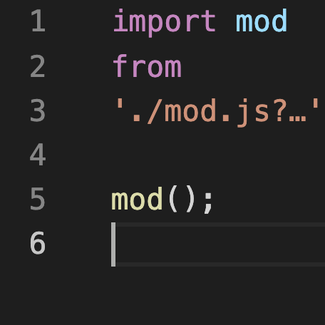

# VS Code ESM URL



This extension installs a TS Server plugin which adds partial support for URL
parts in the ESM `import` statements. Relative local file paths which include
`?search` or `#fragment` bits will have those stripped for the purposes of
module name resolution, resulting in the language service being able to trace
and infer types through module boundaries such as these:

`index.js`
```javascript
// Click through `mod` or `mod.js` and see that it correctly jumps to `mod.js`
import mod from './mod.js?arg';

// Hover over `mod` and see that it correctly shows the inferred return type
console.log(mod());
```

`mod.js`
```javascript
export default function test() {
  return 'test';
}
```

The same thing works for TypeScript files, too!

## Installation

### Marketplace

https://marketplace.visualstudio.com/items?itemName=TomasHubelbauer.vscode-esm-url

### VSIX

```sh
npm install --global vsce

# https://code.visualstudio.com/api/working-with-extensions/publishing-extension#publishing-extensions
vsce login
vsce package

# https://code.visualstudio.com/docs/editor/extension-gallery#_install-from-a-vsix
# vscode-esm-url-${version}.vsix
```

## Credits

The insight and code that makes this extension work was all provided by [Kevin
Ramharak @kevinramharak](https://github.com/kevinramharak) via consulting him
for advice on the [TypeScript Discord](https://discord.com/invite/typescript).

Without him, this extension would not exist. All credit goes to him. Thank you.

## Development

This extension is just a super thing shell around the TS Server plugin repository:

```json
"contributes": {
  "typescriptServerPlugins": [
    {
      "name": "tsserver-esm-url"
    }
  ]
}
```

https://github.com/tomashubelbauer/tsserver-esm-url

## Purpose

Proper ESM URL support in TypeScript is probably months if not years away, this
extension fills the void until that is resolved. You can follow the progress
along here:

https://github.com/microsoft/TypeScript/issues/41730

## To-Do

### Add a GitHub Actions workflow to package the VSIX and release it to GitHub Releases

Maybe automate pushing to the Marketplace as well.
